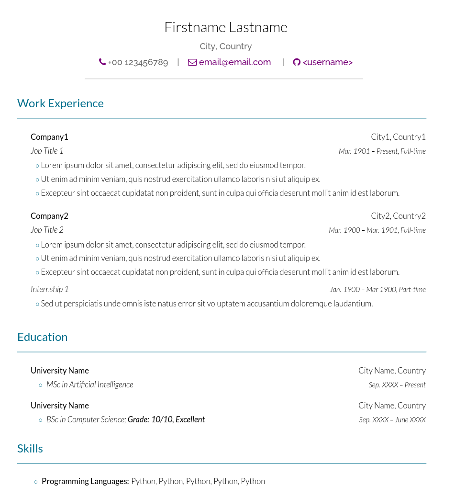

# Single Column Latex CV Template

A simple latex template for a single column CV/resume. It is inspired by
a bunch of other templates, components of which I have used throughout the
years. Unfortunately, I didn't keep track of the authors of the templates
that I've used so I can't give a proper thanks to them.

Please let me know if you like it, or if you'd like to see a new feature to
it. Pull requests are also very welcome! I plan to also add a cover letter
template in the near future.

The current version of this template has only been tested with the XeLaTex
compiler and the 2023 version of TeX Live. If you zip its contents you could
also import it into overleaf.
